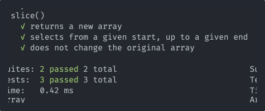

# metals

Small, modern, and complete testing framework for Node.js



## Features

- Zero dependencies
- TypeScript and ESM work out of the box
- Works with any assertion library
- Lifecycle hooks with access to test results during runtime
- No implicit global variables
- Built-in async/await support
- Nested test suites

## Installation

Install globally:

```
npm i -g metals
```

Install in a project:

```
npm i metals
```

## First Test

Metals uses `suite` and `test` to create suites and tests. They are this module's version of `describe` and `it`. If you prefer `describe` and `it`, you can import them instead; they are exported as aliases for `suite` and `test`.

```js
import { suite, test } from "metals";
import assert from "assert";

suite("Array", () => {
  suite("pop()", () => {
    test("returns the last element in an array", () => {
      const arr = [1, 2, 3];
      assert.equal(arr.pop(), 3);
    });
  });
});
```

## Async Tests

To test asynchronous code, use `async` and `await` in the callback of a test block.

```js
import { suite, test } from "metals";
import assert from "assert";

suite("Lib", () => {
  suite("asyncFunc()", () => {
    test("returns true", async () => {
      const result = await asyncFunc();
      assert.equal(result, true);
    });
  });
});
```

## Executing Tests

> Use at least **v18** of node when executing tests

If you've installed the CLI with `npm i -g metals` then you can run commands in the terminal. Otherwise, commands must be ran via a script in your `package.json`.

If you're using TypeScript, make sure that you enable [ts-node](https://www.npmjs.com/package/ts-node) in your `tsconfig.json`:

```json
{
  "tsm": {
    "esm": true
  }
}
```

Execute a test file:

```
metals my.test.js
```

Execute a TypeScript test file:

```
metals my.test.ts
```

Execute all files that match a glob:

```
metals src/*.test.js
```

When a test file is complete, it will use port `5050` to communicate the final number of passed and failed tests. If this is a problem for you, just set the `PORT` environment variable to something else:

```
PORT=4321 metals src/**/*.test.js
```

## Hooks

Hooks allow you to hook into the lifecycle of a test suite and inject custom behavior.

### before

Executes a callback before the first test block of a suite

```js
import { before, suite, test } from "metals";

suite("pop()", () => {
  before(() => {
    console.log("about to run this suite");
  });

  test("returns the last element in an array", () => {
    const arr = [1, 2, 3];
    assert.equal(arr.pop(), 3);
  });
});
```

### beforeEach

Executes a callback before every test block of a suite

```js
import { before, suite, test } from "metals";

suite("pop()", () => {
  beforeEach(() => {
    console.log("about to run this test");
  });

  test("returns the last element in an array", () => {
    const arr = [1, 2, 3];
    assert.equal(arr.pop(), 3);
  });
});
```

### after

Executes a callback after the last test block of a suite

```js
import { before, suite, test } from "metals";

suite("pop()", () => {
  after(() => {
    console.log("just ran this suite");
  });

  test("returns the last element in an array", () => {
    const arr = [1, 2, 3];
    assert.equal(arr.pop(), 3);
  });
});
```

### afterEach

Executes a callback after every test block of a suite

```js
import { before, suite, test } from "metals";

suite("pop()", () => {
  afterEach((state) => {
    console.log(`State: ${state}`); // either "passed" or "failed"
  });

  test("returns the last element in an array", () => {
    const arr = [1, 2, 3];
    assert.equal(arr.pop(), 3);
  });
});
```
